# 🐝 Swarm Mode Demo: Multi-Agent Orchestration

> **Learn how AI agents work together in parallel to complete tasks faster!**

This repository demonstrates **multi-agent orchestration** using GitHub Copilot CLI. Watch multiple AI agents work simultaneously on different tasks, then merge their work together.

---

## 🎯 What You'll Learn

| Concept | Description |
|---------|-------------|
| **Orchestrator** | The "boss" agent (Copilot in chat) that assigns and tracks tasks |
| **Background CLI Agent** | Worker agents spawned via `Start-Job` + `copilot` CLI |
| **Waves** | Groups of tasks that can run in parallel |
| **Memory** | How agents communicate progress |

---

## 🚀 Quick Entry Points (Slash Commands)

| Command | Description |
|---------|-------------|
| `/swarm-start` | Start fresh build from Wave 0 |
| `/swarm-resume` | Continue an interrupted build |
| `/swarm-status` | Check build progress and state |

> **🆕 APM Improvements**: This version includes enhancements inspired by [Agentic Project Management](https://github.com/sdi2200262/agentic-project-management). See [ReadMeImprovement.md](ReadMeImprovement.md) for details.

---

## ⚠️ Key Clarifications: Agent Types

Understanding the difference between agent types is **critical**:

| Type | How to Spawn | Execution | Edits Files? | Use For |
|------|--------------|-----------|--------------|---------|
| [**Background CLI Agent**](https://code.visualstudio.com/docs/copilot/agents/background-agents#_create-an-isolated-background-agent-session-experimental) | `Start-Job` + `copilot` CLI | True parallel, isolated worktree | ✅ YES | Actual coding tasks |
| [**Subagent**](https://code.visualstudio.com/docs/copilot/chat/chat-sessions#_contextisolated-subagents) (`runSubagent` tool) | `runSubagent(...)` in chat | Synchronous, within chat | Optional | Analysis, research |

**For parallel task execution, always use Background CLI Agents:**
```powershell
Start-Job -Name "agent-models" -ScriptBlock {
    Set-Location "C:\Temp\GIT\wt-models"
    copilot -p "Build models..." --allow-all-tools
}
```

**Monitor with:**
```powershell
Get-Job | Where-Object { $_.Name -like "agent-*" }
```

The `runSubagent` tool in VS Code Copilot is **not** for parallel execution - it runs synchronously within your chat session and is best used for quick analysis or research tasks between waves.

### Example: Using Subagent for Research

```
You: "Run Wave 0 tasks for models and CSS"
Copilot: [Spawns Background CLI Agents via Start-Job]
Copilot: "Wave 0 complete."

You: "Use a subagent to review the models and suggest service methods"
Copilot: [Calls runSubagent internally, waits for result]
Copilot: "Analysis complete. The Venue model has 12 properties, 
         suggesting these service methods: GetByCity, FilterByPetType..."

You: "Good, now spawn Wave 1 agents with that context"
Copilot: [Spawns Background CLI Agents with enriched prompts]
```

**Why use subagents for research?**

Subagents run in the same session but get their own dedicated context window. At the end, they yield the result back to the main session - keeping it uncluttered from the task-specific context gathered during research. The orchestrator receives only the findings, not all the resources the subagent gathered along the way.

**Benefits:**
- **Isolated context**: Subagent gets a clean, focused context window for the research task
- **Clean handoff**: Returns only key findings back to the orchestrator, not a full file dump
- **Enriched prompts**: Use research findings to craft better prompts for Background CLI Agents
- **No file conflicts**: Since subagents don't edit files, they can safely analyze while agents work
- **Uncluttered session**: Main orchestrator stays focused on coordination, not buried in research details

### 🚀 Optimization: Research Between Waves

For complex builds, use subagent research checkpoints between waves to improve accuracy:

| After Wave | Research Task | Benefit |
|------------|---------------|---------|
| Wave 0 (Models) | Analyze model properties and enums | Services get exact type signatures |
| Wave 1 (Services) | Review service interfaces | Components know available methods |
| Wave 2 (Components) | List component parameters | Pages use correct bindings |
| Wave 3 (Pages) | Run build, check errors | Integration agent has complete picture |

See [implementation.md](.docs/implementation.md) for specific research prompts at each checkpoint.

---

## 📋 Prerequisites

Before starting, you need:

- [ ] **VS Code** with GitHub Copilot extension
- [ ] **Git** installed and configured
- [ ] **.NET 9 SDK** (for the demo app)
- [ ] **GitHub Copilot CLI** (install below)

### Install GitHub Copilot CLI

```powershell
# Check if Copilot CLI is installed
copilot --version

# If not installed:
winget install GitHub.Copilot
```

---

## 🗺️ How It Works

```mermaid
flowchart TB
    subgraph START ["🚀 YOU START HERE"]
        A[Open VS Code] --> B[Load swarm-mode.prompt.md]
        B --> C["Say: Build the app"]
    end
    
    subgraph ORCHESTRATOR ["🎭 ORCHESTRATOR DOES THIS"]
        D[Read Task Plan] --> E[Build Dependency Graph]
        E --> F{Tasks Independent?}
        F -->|Yes| G[Group into Wave]
        F -->|No| H[Wait for Dependencies]
    end
    
    subgraph WAVE0 ["🌊 WAVE 0 - PARALLEL"]
        I[Agent 1: Task 1]
        J[Agent 2: Task 2]
    end
    
    subgraph WAVE1 ["🌊 WAVE 1 - AFTER WAVE 0"]
        K[Agent 3: Task 3]
    end
    
    subgraph FINISH ["✅ RESULTS"]
        L[Check memory.md]
        M[Check report.xlsx]
        N[See Changed Files]
    end
    
    C --> D
    G --> I & J
    I & J --> H
    H --> K
    K --> L & M & N
```



---

## 🚀 Quick Start (5 Steps)

### Step 1: Open VS Code
Open this folder in VS Code:
```powershell
code c:\Temp\GIT\simplepetapp
```

### Step 2: Open Copilot Chat
Press `Ctrl+Shift+I` (or click the Copilot icon)

### Step 3: Run the Orchestrator

```powershell
# Clean the workspace first
.\cleanup.ps1
```

Then in **VS Code Copilot Chat** (`Ctrl+Shift+I`), simply type:

```
/swarm-start
```

**That's it!** The slash command loads all required context automatically.

> **Alternative** (manual prompt if slash commands don't work):
> ```
> #file:swarm-instruction.md #file:swarm-mode.prompt.md #file:implementation.md 
> Build the complete MyPetVenues app using parallel background agents.
> ```

### Step 4: Watch the Magic! ✨

1. AI reads the task plan and analyzes dependencies
2. Groups independent tasks into waves
3. Creates git worktrees for isolation
4. Spawns parallel Background CLI Agents via `Start-Job` + `copilot`
5. Uses subagent research between waves to enrich prompts
6. Merges completed work and continues to next wave
7. Final integration and cleanup

**Wave Breakdown (17 Tasks):**
| Wave | Tasks | Agents |
|------|-------|--------|
| 0 | Foundation | 3 parallel (Project, Models, CSS) |
| 1 | Services & Layout | 3 parallel |
| 2 | Components | 5 parallel |
| 3 | Pages | 5 parallel |
| 4 | Integration | 1 (final wiring) |

**Result**: Complete app built in ~25-35 minutes vs ~70 minutes sequential!

### Step 5: Check Results
Look at these files when done:
- `.docs/memory.md` - Progress log from each agent
- `.docs/report.xlsx` - Final summary with metrics

---

## 📁 File Map

```mermaid
flowchart LR
    subgraph LEARN ["📚 Learn (Read These)"]
        A["swarm-instruction.md<br/>Concepts & Theory"]
    end
    
    subgraph RUN ["🏃 Run (Use These)"]
        B["swarm-mode.prompt.md<br/>Operations Guide"]
        C["implementation.md<br/>Build Plan (17 tasks)"]
    end
    
    subgraph CHECK ["✅ Check (Results Here)"]
        D["memory.md<br/>Progress Log"]
        E["report.xlsx<br/>Final Report"]
    end
    
    A --> B --> C --> D --> E
```



| File | Location | Purpose |
|------|----------|---------|
| This README | `README.md` | Start here! |
| **Cleanup Script** | `cleanup.ps1` | Reset repo for fresh demo |
| Concepts | `.github/instructions/swarm-instruction.md` | Learn the theory |
| Operations | `.github/prompts/swarm-mode.prompt.md` | How to run agents |
| **Build Plan** | `.docs/implementation.md` | Full app build (17 tasks, 5 waves) |
| Progress | `.docs/memory.md` | Agent updates |
| Report | `.docs/report.xlsx` | Final summary |

---

## 🌊 Understanding Waves

```mermaid
gantt
    title Sequential vs Parallel Execution
    dateFormat X
    axisFormat %s
    
    section Sequential 😴
    Task 1 (5 min)    :a1, 0, 5
    Task 2 (5 min)    :a2, after a1, 5
    Task 3 (4 min)    :a3, after a2, 4
    
    section Parallel 🚀
    Task 1 (5 min)    :b1, 0, 5
    Task 2 (5 min)    :b2, 0, 5
    Task 3 (4 min)    :b3, after b1, 4
```



**Key Insight**: Tasks 1 & 2 have no dependencies, so they run at the same time!

- **Sequential**: 5 + 5 + 4 = **14 minutes**
- **Parallel**: 5 + 4 = **9 minutes** (36% faster!)

---

## 📊 What Gets Built

The full build creates a complete Blazor WebAssembly app:

```mermaid
flowchart TB
    subgraph WAVE0 ["Wave 0: Foundation"]
        T1["🏗️ Project Setup"]
        T2["📦 Domain Models"]
        T3["🎨 Global CSS"]
    end
    
    subgraph WAVE1 ["Wave 1: Core"]
        T4["⚙️ Services"]
        T5["📐 Layout"]
        T6["🌓 Theme"]
    end
    
    subgraph WAVE2 ["Wave 2: Components"]
        T7["🃏 VenueCard"]
        T8["⭐ StarRating"]
        T9["💬 ReviewCard"]
        T10["🔍 SearchFilters"]
        T11["🏷️ Badges"]
    end
    
    WAVE0 --> WAVE1 --> WAVE2
```



---

## ❓ Troubleshooting

### Copilot CLI not found
```powershell
# Install Copilot CLI
winget install GitHub.Copilot
```

### Build errors
```powershell
dotnet build MyPetVenues/MyPetVenues.csproj
```

### Memory file not updating
Make sure agents have write access to `.docs/memory.md`

---

## 🎓 Learning Path

```mermaid
flowchart LR
    A["1️⃣ Read This<br/>README"] --> B["2️⃣ Run Full Build<br/>17 Tasks"]
    B --> C["3️⃣ Review Report<br/>report.xlsx"]
    C --> D["4️⃣ Read Concepts<br/>swarm-instruction.md"]
    D --> E["5️⃣ Create Your<br/>Own Tasks"]
```



| Level | What to Do |
|-------|------------|
| **Beginner** | Run the full build, watch agents work in parallel |
| **Intermediate** | Study report.xlsx to understand Background CLI vs Subagent usage |
| **Advanced** | Modify `implementation.md`, create your own multi-wave plans |

---

## 🔄 Repeatable Demo Workflow

```powershell
# Reset workspace before demo
.\cleanup.ps1

# Then use the Copilot Chat prompt (see Step 3)

# After demo, reset again for next audience
.\cleanup.ps1
```

### How Agents Are Spawned

The AI orchestrator spawns **real background jobs** visible in the monitor:

```powershell
Start-Job -Name "agent-taskname" -ScriptBlock {
    Set-Location "path/to/worktree"
    copilot -p "task prompt" --allow-all-tools
}
```

This approach shows how the model:
1. Reads and understands the task plan
2. Analyzes dependencies
3. Groups tasks into waves
4. Spawns parallel agents intelligently

---

## 🔑 Key Commands

```powershell
# Check Copilot CLI
copilot --version

# Build the app
dotnet build MyPetVenues/MyPetVenues.csproj

# Run the app (optional)
dotnet run --project MyPetVenues/MyPetVenues.csproj

# Check agent job status (during run)
Get-Job | Where-Object { $_.Name -like "agent-*" }

# View agent output
Receive-Job -Name "agent-models"

# Spawn an agent manually (example)
Start-Job -Name "agent-models" -ScriptBlock {
    Set-Location "C:\path\to\worktree"
    copilot -p "Your task..." --allow-all-tools
}
```

---


**How agents run**: Background CLI Agents are spawned as PowerShell background jobs using `Start-Job`. Each job runs `copilot` CLI in a separate git worktree.

```powershell
# Terminal 1: Start the monitor (shows live agent status)

# What you'll see:
#   🐝 SWARM MONITOR  [21:30:45]
#   ════════════════════════════════════════
#
#   Active Agents: 3
#
#   RUNNING:
#     🔄 agent-models   02:15
#     🔄 agent-services 02:10
#     🔄 agent-css      01:58
#
#   COMPLETED: 0
```

**Job naming convention**: Agents are named `agent-<taskname>` so the monitor can:
- Count active agents
- Track which tasks are running
- Track duration of each agent

**Manual monitoring commands**:
```powershell
# List all agent jobs
Get-Job | Where-Object { $_.Name -like "agent-*" }

# Get output from specific agent
Receive-Job -Name "agent-models"

# Stop all agents
Get-Job | Where-Object { $_.Name -like "agent-*" } | Stop-Job

# Clean up completed jobs
Get-Job | Where-Object { $_.State -eq "Completed" } | Remove-Job
```

---

## �📝 Glossary

| Term | Meaning |
|------|---------|
| **Orchestrator** | Main Copilot instance (in chat) that coordinates all work |
| **Background CLI Agent** | Worker agent spawned via `Start-Job` + `copilot` CLI |
| **Wave** | Group of independent tasks that run in parallel |
| **Worktree** | Isolated Git workspace for each agent |
| **Memory** | Shared file (`.docs/memory.md`) for progress tracking |

---

## � Worktrees vs Branches

**Why not just use branches?**

| Branch | Worktree |
|--------|----------|
| Just a pointer to commits | A **full separate folder** with files |
| One branch checked out at a time | Multiple branches checked out simultaneously |
| `git checkout` switches files in place | Each worktree has its own copy of files |
| Agents would overwrite each other! | Agents work in **complete isolation** |

**Worktree Lifecycle:**
```
1. CREATE    →  git worktree add ..\worktree-task1 -b task-1
2. WORK      →  Agent edits files, commits changes
3. MERGE     →  git merge task-1 (back to main)
4. CLEANUP   →  Remove-Item ..\worktree-task1; git worktree prune; git branch -d task-1
```

**Think of it this way**: A branch is like a bookmark. A worktree is like making a photocopy of the entire book so two people can read different chapters at the same time.

---

## 🎉 Success Checklist

**Build Verification:**
- [ ] Application builds: `dotnet build MyPetVenues/MyPetVenues.csproj`
- [ ] App runs: `dotnet run --project MyPetVenues/MyPetVenues.csproj`
- [ ] All 5 waves completed in `.docs/memory.md`
- [ ] ~50% time saved vs sequential execution

**Understanding the Report (for students):**
- [ ] **Tasks sheet**: Shows "Background CLI" type for parallel workers
- [ ] **Research sheet**: Shows subagent analysis calls between waves
- [ ] **Agents sheet**: Lists all Background CLI agents with worktrees
- [ ] Compare: Background CLI agents = parallel work, Subagents = research checkpoints

---

## 📚 Additional Resources

- [GitHub Copilot CLI Docs](https://docs.github.com/en/copilot)
- [Git Worktrees Explained](https://git-scm.com/docs/git-worktree)
- [Blazor Documentation](https://learn.microsoft.com/aspnet/core/blazor)

---

<div align="center">

**Ready to start?** Open VS Code and run the demo! 🚀

*Made with 🐝 by the Swarm Mode Demo*

</div>
