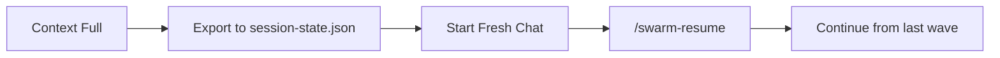

# 🔄 Swarm Mode APM Improvements

> **What?** Enhancements inspired by [Agentic Project Management (APM)](https://github.com/sdi2200262/agentic-project-management)
> **Why?** Better UX, resilience, and learnability for students

---

## 📊 What We Borrowed (and Why)

| APM Feature | Our Implementation | Why It Helps Students |
|-------------|-------------------|----------------------|
| **Session Handoff** | `.docs/session-handoff.md` | Recover from context overflow mid-build |
| **Specialized Roles** | Agent personas in prompts | Understand *why* different tasks need different approaches |
| **Slash Commands** | `/swarm-start`, `/swarm-resume`, `/swarm-status` | Easy entry points, no hunting for files |
| **Discovery Phase** | Phase 0 in implementation plan | See planning before execution |
| **Context Budgeting** | Guidelines in swarm-instruction.md | Learn to manage AI context limits |

---

## 🎯 Key Difference: Our Advantage

```
┌─────────────────────────────────────────────────────────────┐
│  APM                          │  Our Swarm Mode             │
├───────────────────────────────┼─────────────────────────────┤
│  Agents in single chat        │  TRUE PARALLEL execution    │
│  Sequential coordination      │  Start-Job + git worktrees  │
│  Manual context management    │  Automated via memory.md    │
│  No metrics tracking          │  Excel report with tokens   │
└─────────────────────────────────────────────────────────────┘
```

**We keep**: True parallelism, worktree isolation, Excel metrics, subagent research
**We add**: Session recovery, slash commands, specialized roles, context awareness

---

## 🆕 New Entry Points (Slash Commands)

Instead of hunting for files, students now just type:

| Command | What It Does |
|---------|--------------|
| `/swarm-start` | Fresh build from Wave 0 |
| `/swarm-resume` | Continue interrupted build |
| `/swarm-status` | Check progress (memory + report) |

**How?** These are prompt files in `.github/prompts/` - VS Code Copilot auto-discovers them.

---

## 🛟 Session Handoff (New Safety Net)

**Problem**: What if context fills up mid-build?

**Before**: Start over, lose progress 😢

**After**: Export state → Fresh session → Resume 🎉



See `.docs/session-handoff.md` for the protocol.

### When to Use `/swarm-resume`

| Scenario | What Happened | Action |
|----------|---------------|--------|
| **Context Overflow** | Copilot gets confused mid-build, repeats itself | Export state → New chat → `/swarm-resume` |
| **VS Code Crash** | App crashed, worktrees may exist with partial work | `/swarm-resume` cleans up and continues |
| **Intentional Pause** | You stopped to review after Wave 2 | `/swarm-resume` picks up at Wave 3 |

> **Tip**: `/swarm-status` can be run in a **second** Copilot chat panel while the main build runs. Or use `Get-Job` in terminal to check agent status manually.

---

## 👥 Specialized Agent Roles (New)

Before: Generic `agent-taskname` workers

After: Role-based personas with tailored system prompts

| Role | Focus | Example Tasks |
|------|-------|---------------|
| `agent-architect` | Structure, patterns | Project setup, models |
| `agent-stylist` | Visual design, CSS | Themes, animations |
| `agent-implementer` | Feature code | Components, pages |
| `agent-integrator` | Wiring, testing | Program.cs, final build |

**Why?** Different prompts = better results. A stylist knows CSS tricks; an integrator knows DI patterns.

---

## 📏 Context Budgeting (New Awareness)

Students learn to think about AI limits:

```
Rule of Thumb:
- Each wave should use < 25% of orchestrator's context
- If a wave has 5+ agents, consider research checkpoint
- Large file edits = high token cost
```

This isn't just about Copilot - it's transferable knowledge for any LLM work.

---

## ✅ Summary for Students

1. **Easier to start** → Use `/swarm-start` instead of finding files
2. **Safer to run** → Session handoff if something goes wrong
3. **Better to understand** → Specialized roles show *why* tasks differ
4. **More to learn** → Context budgeting teaches LLM fundamentals

---

**TL;DR**: Same powerful parallel execution, now with better UX and resilience.
